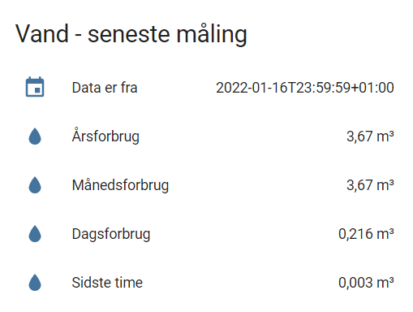

# Novafos/Easy-Energy integration

[](https://github.com/custom-components/hacs)

The `novafos` component is a Home Assistant custom component for monitoring your water metering data from Novafos (via KMD Easy-Energy)

---
# Installation
---

### Manual Installation
  1. Copy novafos folder into your custom_components folder in your hass configuration directory.
  2. Configure the `novafos` sensor.
  3. Restart Home Assistant.

### Installation with HACS (Home Assistant Community Store)
  1. Ensure that [HACS](https://hacs.xyz/) is installed.
  2. Search for and install the `novafos` integration.
  3. Configure the `novafos` sensor.
  4. Restart Home Assistant.

---
## Configuration
---

Fully configurable through config flow.
  1. Head to configuration --> integration
  2. Add new and search for novafos
  3. Enter email address and pasword as registered with Novafos.
     If you haven't done this before you need to login using NemId/MitId and
     setup email and password first.
  4. Enter the supplier ID as well.  Until a better way to get this automatically is identified, you can get the value from the next section.<br>

### Get the supplier id

| Municipality  | supplier id |
|---------------|-------------|
| Allerød       | 0642000     |
| Ballerup      | 0618000     |
| Egedal        | 0378000     |
| Furesø        | 0378000     |
| Frederikssund | 0642000     |
| Gentofte      | 0676000     |
| Gladsaxe      | 0676000     |
| Hørsholm      | 0398000     |
| Rudersdal     | 0642000     |

If your municipality isn't listed above, try one of these methods:

#### Method 1.

In chrome press F12, and select the "Network" tab.
Login on the https://minforsyning-2.kmd.dk webpage.
Inspect the first few entries. You should see something along the lines of: https://<7-digit number>.webtools.kmd.dk/wts/... The 7 digit number is your supplier ID.

#### Method 2.

In chrome press F12, and select the "Network" tab.
Login on https://novafos.dk/selvbetjening/mit-forbrug using the "Klik her og login" button
Login using nemID, and look for the request "ExternalLogin?returnUrl...."
Inspect the "Headers" tab and under "General" -> "Request URL" you should see a parameter in the URL "...utility=<7-digit number>&...."
The 7 digit number is your supplier ID

---
# Notice on integration status and ways to login
---

Novafos and probably other suppliers changed their login page to use a hidden reCAPTCHA.  The very purpose of reCAPTCHA is to tell humans and machines apart.
The effect of this little change is that the plugin is basically rendered useless except for the two workarounds implemented.  Both workarounds
utilise that after proper authentication a session token is handed out to access the data API.

This is _your_ data.  If you want to ensure free and opensource access to your data in your own home, please help KMD realise there is a need for this.  Sure the claim can be that you have free access to your data through the portal, and even through the Watts app only available on mobile devices.  These are all closed source solutions however, and eliminates homegrown solutions like Home Assistant to thrive.

If you use the integration please write to KMD Easy-energy, or call their contact number to ask for this.  You can even give an example of where this actually works by referring to eloverblik.dk where a personal access token can be generated and used by your own tools.

Until KMD Easy-energy agrees to provide open access to your own data, the integration needs a little help now and then.

## Method 1: Login on website and copy token to Home Assistant

This first method is 100% manual, but will ensure you get data into Home Assistant regardless.  Why would you do this then?  Well I cannot say, but maybe doing this once per week or month is a good way to keep tabs on consumption or dripping faucets along with all your other precious data.

This is how the manual method works:

1. Use F12 inyour browser to turn on developer tools
1. Login using your browser as you would do without Home Assistant on the website.
1. Investigate the network traffic and find the line including "token".  Just search for this word.
1. Switch to the Response tab. You see this:
   ```
   {
     "access_token": "<token>",
     "token_type": "Bearer",
     "expires_in": 3599,
     "scope": "openid profile pluginapi_int",
     "id_token": "<id token>"
   }   
   ```
1. Go to the integration page in settings and select "Configure" on the Novafos integration.
1. Copy the `access_token` part into the Access Token field (this is a very long string of random characters)
1. The integration will sense the token changed and trigger only within the next 45 minutes to update the sensors.
1. Data is fetched as usual.
1. Repeat as often as you like - you are using a token generated from a human interaction, satisfying the login process.

## Method 2: Using Chrome add-on (medium advanced, recommended).

Install the Chrome extension in the addons/ha-novafos-token folder.  See the README file in the addons directory for the details.  The extension automates scraping the token and sendign it to Home Assistant.
Note you have to setup Home Assistant to be accessed through HTTPS.

## Method 3: Using Selenium web-driver (advanced, experimental and not recommended)

If you try this method, please bear in mind it is an attempt to automate that which cannot be automated.  Also accept that this is targeted at how the Novafos login page looks like and may need modifications for other suppliers' login screens.  Lastly, I cannot support you if it does not work, you need to debug and help out with more endpoints which looks differently.

This is work in progress too, provided as-is and works-for-me.

With that said...

The principle is to software control the normal login process you would do on the website, and let the browser resolve that part of the process including robot detection.  The software attempts to not look like a robot, and rests on very seldom access because only once per 24h is access really needed.  Combined this hopefully is enough to not get caught in the robot detection heuristics.

What you need to do:

1. You need a docker host and access to build a docker image
1. Build the docker container using the `Dockerfile` in the `docker`directory

       docker build -t ha/ha-pyapi:1.0 .

1. Run the docker container
  
       docker run --name pyapi -p 5000:5000 -p 5900:5900 ha/ha-pyapi:1.0

1. If you stop the container for rebuilding you need to remove the old one before starting a new one

       docker rm pyapi

1. With this container running you now have two endpoints available on `http://<docker_host>:5000/novafos-token` and `http://<docker_host>:5000/novafos-token-test`.  Additionally you have a VNC service running on port `5900`. The VNC password is "secret"

1. You then need to modify the `coordinator.py` file.  Search for `selenium_host_url`and update to match your IP-address of the docker host.

By the way - if you are lazy, you may try out the docker-compose file instead.

### First test

The first test uses the test end-point with a token you put in, and serves the purpose of verifying the container runs as intended and Home Assistant can access it properly.

1. Begin with the `novafos-token-test` URL and update the `pyapi.py` file with a token you got from using Method 1 above.  Rebuild the container after doing this.

1. Bring up your (test) instance of Home Assistant with full debugging info activated and observe the log.  You are looking for

       2022-10-17 00:22:42 DEBUG (MainThread) [custom_components.novafos] Novafos ConfigData: {'supplierid': '<...', 'username': '<...>', 'password': '<...>', 'name': 'Novafos'}
       2022-10-17 00:22:42 DEBUG (MainThread) [custom_components.novafos.coordinator] Next update at: 2022-10-18 03:03:00.189765

   If the token you put in at the test endpoint is still okay (remember 1 hour validity) you should shortly after see the initial poll after a restart:

       2022-10-17 00:23:05 DEBUG (SyncWorker_3) [custom_components.novafos.pynovafos.novafos] Got bearer token (access to API was Ok) valid for 3599s: Bearer eyLotsOfRandomCharcters...
       2022-10-17 00:23:05 DEBUG (SyncWorker_2) [custom_components.novafos.pynovafos.novafos] Retrieved customer_id: <...>
       2022-10-17 00:23:06 DEBUG (SyncWorker_2) [custom_components.novafos.pynovafos.novafos] Got active (water) meters : [{'InstallationId': <...>, 'MeasurementPointId': <...>, 'Unit': {'Id': <...>, 'Name': 'm³', 'Description': 'Vand', 'Decimals': 0, 'Order': 1}}]
       2022-10-17 00:23:06 DEBUG (SyncWorker_2) [custom_components.novafos.pynovafos.novafos] Getting Day data from 2022-10-01T00:00:00.000Z to 2022-10-31T00:00:00.000Z
       2022-10-17 00:23:06 DEBUG (SyncWorker_2) [custom_components.novafos.pynovafos.novafos] {
          "SheetName": null,
          "Series": [
              {
                  "Data": [
                      {
                          "DateFrom": "2022-10-01T00:00:00+02:00",
       ... and so on ...

1. You should see the sensors update as usual.

If all of this works, you know the docker container is running and the service can be accessed from Home Assistant.

### Second test

This is the second test, now using the real endpoint. If you do this many times over in a short timeframe you may get tagged as a robot and will need to login manually and wait for some hours.

1. Start a VNC client and point it to your docker host port `5900`.
1. Update the `coordinator.py` file to use the `novafos-token`endpoint.
1. Start Home Assistant.  You should see the same log entries as above, but also in the VNC viewer a browser start up, and the login process complete.  This is the point where you may get stuck and there is really nothing to do about it other than waiting it out.

If this works, let it run and be happy.

---
# State and attributes

!Note! Data is delayed in the data warehouse.  Data validity will range from 24h to 5 days ago from today's midnight.  This means the sensor data represents historical data.

The integration creates the following sensors:
* sensor.novafos_year_total
  * The total consumption until the last valid date
* sensor.novafos_month_total
  * The total consumption current until the last valid date
* sensor.novafos_day_total
  * The total consumtion on the last valid date
  * Attributes contain day data since the first day of the month at the correct dates
* sensor.novafos_hour_total
  * The hourly consumption on the last valid date. The sensor will return unknown if the valid date is older than 24h
  * Attributes contain data from the last 24 hours on the correct date
* sensor.novafos_valid_date
  * Just the date of the last valid data

All water sensors show their value in cubic meters (m3).  The sensors also have extended attributes as outlined above, which can be used by ex. apexchart-card to chart data at the correct date.  You can also create new sensors from these attributes to save them in the history database.  Attributes are not saved in the history.

## Debugging
It is possible to debug log the raw response from KMD API. This is done by setting up logging like below in configuration.yaml in Home Assistant. It is also possible to set the log level through a service call in UI. Be aware that a lot of information is dumped to the log, so only have this activated when reporting a bug.
```
logger: 
  default: info
  logs: 
    custom_components.novafos: debug
```

## Examples

### Entity card with latest sensor data
This example is just an entity card with the latest data of all sensors.  It shows when the latest data was valid as a reference.



## Apexchart card with data placed at the correct date
This is a configuratio for the apexchart card.  Because data retrieved today may be at least 24 hours old, graphing the sensor state will put values on the wrong date.
If this is not wanted, the sensors also provide attributes with the data and the correct dates.  Apexchart can graph this.

TBD:
One caveat though is that attributes are not saved in the sensor history.  So what the module does is to fetch daily use from the start of the month, and hourly data 7 days back or so.  Then from the attributes it is at least possible to put daily and hourly use at the correct date.

The sensors still save daily and hourly values but remember these values are only as valid as the latest data available from the API.

```
type: custom:apexcharts-card
graph_span: 7d
span:
  end: day
  offset: '-1d'
header:
  show: true
  title: Water year to date
  show_states: true
  colorize_states: true
yaxis:
  - id: left
    decimals: 3
  - id: right
    opposite: true
    decimals: 2
series:
  - entity: sensor.novafos_day_total
    extend_to_end: false
    type: column
    yaxis_id: left
    data_generator: |
      return entity.attributes.data.map((start, index) => {
        return [new Date(start["DateTo"]).getTime(), entity.attributes.data[index]["Value"]];
      });
  - entity: sensor.novafos_hour
    extend_to_end: false
    yaxis_id: left
    type: column
    data_generator: |
      return entity.attributes.data.map((start, index) => {
        return [new Date(start["DateTo"]).getTime(), entity.attributes.data[index]["Value"]];
      });
  - entity: sensor.novafos_year_total
    type: column
    yaxis_id: right
    data_generator: >
      return [[new Date(entity.attributes.last_valid_date).getTime(),
      entity.state]]
  - entity: sensor.novafos_month_total
    type: column
    yaxis_id: right
    data_generator: >
      return [[new Date(entity.attributes.last_valid_date).getTime(),
      entity.attributes.data[0]["Value"]]]
```

