# Novafos/Easy-Energy integration

[](https://github.com/custom-components/hacs)

The `novafos` component is a Home Assistant custom component for monitoring your water metering data from Novafos (via KMD Easy-Energy).

---
# Installation
---

### Manual Installation
  1. Copy novafos folder into your custom_components folder in your hass configuration directory.
  2. Restart Home Assistant
  3. Add and configure the Novafos integration.
  4. Restart Home Assistant.

### Installation with HACS (Home Assistant Community Store)
  1. Ensure that [HACS](https://hacs.xyz/) is installed.
  2. Search for and install the Novafos integration.
  3. Add and configure the Novafos integration.
  4. Restart Home Assistant.

---
## Configuration
---

Fully configurable through config flow.
  1. Head to configuration --> integration
  2. Add new and search for Novafos
  3. Enter your name for the sensors, default is "Novafos", but if you have more, go ahead and change it.
  4. If you want extra sensors with statistics for grouped data by day, week, month, and year, check this box.
  5. Enter a working access token to get started.  This will pre-load statistics 1 calendar year back in time.
     You can enter some random text to create the sensors without the pre-load of data.

---
# Notice on integration status and ways to login
---

The integration works only off valid Bearer tokens extracted from a 'proper' login on the Novafos website.
If you want to make it really easy, you may want to check out the Chrome extension I wrote for that very purpose.
Check this repository: https://github.com/kpoppel/homeassistant-novafos-chrome-addon

Unfortunately Novafos and KMD "Easy-Energy" does not care anything about secure machine-usable access to their customer's
data, except through their own services, like the website, and the proprietary Watts app.

The extension used to be able to login using OICD (which is pretty safe, right), or email/password combination, but through
the introduction of reCAPTCHA, this is no longer possible to automate.  This is the reason the extension relies on
a human login, after which the rest can be automated.

Want to help the digital age for _your_ data? If you want to ensure free and opensource access to your data in your own home,
please help KMD realise there is a need for this.  Sure the claim can be that you have free access to your data through the
portal, and even through the Watts app only available on mobile devices.  These are all closed source solutions however,
and eliminates homegrown solutions like Home Assistant to thrive.

If you use the integration please write to KMD Easy-energy, or call their contact number to ask for this.  You can even give
an example of where this actually works by referring to eloverblik.dk where a personal access token can be generated and used
by your own tools.

Until KMD Easy-energy agrees to provide open access to your own data, the integration needs a little help now and then.

There is a thread on the forum as well: https://community.home-assistant.io/t/hidden-recaptcha-on-novafos-smart-water-meter/559633

# Login methods

## Method 1: Using Chrome add-on (medium advanced, has some requirements, recommended).

Install the Chrome extension from this Github repository: https://github.com/kpoppel/homeassistant-novafos-chrome-addon/releases.
README file in that place for the details. The extension automates scraping the token and sending it to Home Assistant.
Note you have to setup Home Assistant to be accessible through HTTPS.

## Method 2: Login on website and manually find and copy token to Home Assistant

This method is 100% manual, but will ensure you get data into Home Assistant regardless.  Why would you do this then?
Well I cannot say, but maybe doing this once per week or month is a good way to keep tabs on consumption or dripping
faucets along with all your other precious data.

This is how the manual method works:

1. Use F12 inyour browser to turn on developer tools
1. Login using your browser as you would do without Home Assistant on the website.
1. Investigate the network traffic and find the line including "token".  Just search for this word.
1. Switch to the Response tab. You see this:
   ```
   {
     "access_token": "<token>",
     "token_type": "Bearer",
     "expires_in": 3599,
     "scope": "openid profile pluginapi_int",
     "id_token": "<id token>"
   }   
   ```
1. Go to the integration page in settings and select "Configure" on the Novafos integration.
1. Copy the `access_token` part into the Access Token field (this is a very long string of random characters)
1. The integration will sense the token changed and trigger only within the next 45 minutes to update the sensors.
1. Data is fetched as usual.
1. Repeat as often as you like - you are using a token generated from a human interaction, satisfying the login process.

---
# State and attributes

Data is delayed in the data warehouse.  Data validity will range from 24h to 5 days ago from today's midnight.
This means the sensor data represents historical data and that the sensors presented by the integration have no current state (unknown).
However all sensors are statistics sensors and can be shown using statistics cards, statistics graph and through apex-charts
like any other sensor with real-time data.

This means we have a slightly different visualisation flow compared to other sensors.

The integration creates the following sensors for water/heating (here water used an an example).  "novafos" is configurable, this is the default value:
* sensor.novafos_water_statistics
  * Statistics sensor with hourly resolution.  Has (historical) state, max, min, mean value.
* sensor.novafos_water_statistics_{day|week|month|year} (optional)
  * The total consumption current until the last valid date

All water sensors show their value in cubic meters (m3) or for heating kWh.  The sensors have no attributes at this point in time.
Under consideration is adding attributes for some sort of high/low warning so that an indication for high water use or never having zero flowcould be flagged.

# Visualisation of the sensors using built-in cards

Below some examples of how data can be visualised.  Only water is shown but the same should apply for heating data.

## The main sensor: sensor.novafos_water_statistics

The current state of this sensor is always 'unknown'.  Use the statistics card and statistics graph card for displaying data.
As the base data is hourly we can group data in day, week, month categories.

### Statistics graphs

Here are examples of the various graphs you can make using the built-in cards.

#### Monthly data

- Card: Statistics graph
  - Period: Month
  - Stat type: Change
  - Chart type: Bar

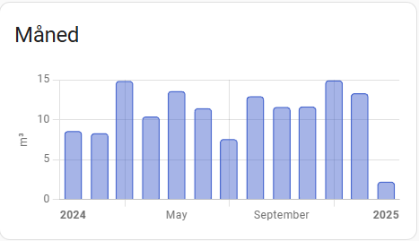

#### Weekly data

- Card: Statistics graph
  - Period: Week
  - Stat type: Change
  - Chart type: Bar

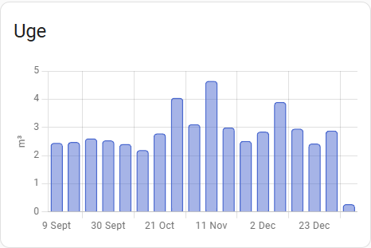

#### Daily data

- Card: Statistics graph
  - Period: Day
  - Stat type: Change
  - Chart type: Bar

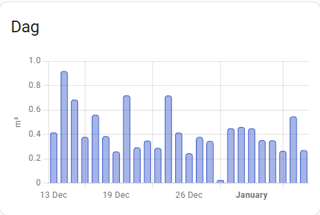

#### Hourly data

- Card: Statistics graph
  - Period: Hour
  - Stat type: Change
  - Chart type: Bar

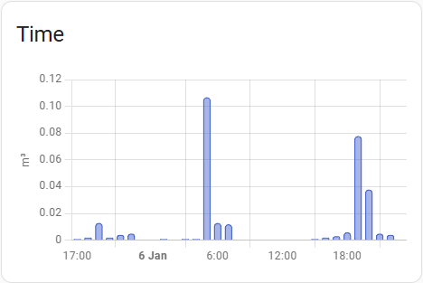

For the hourly data you can furthermore get some nice graphs showing the mean value, min and max consumption across the periods.

**Examples:**

In all these examples the visualisation shows the _hourly_ min max and mean data grouped over the period.
This means you are looking at the variation on hourly consumption over longer and longer time spans.
If you want to see statistics where the statistics are calculated over the magnitude of the period - enable the optional sensors and look further down!

With these charts though you can see trends in daily use. Here for example we can see that March, July/August,
and October seem to be high runners in consumption.  This corresponds well with setting up and cleaning the greenhouse Spring and Fall, and watering
the plants and little pool over the Summer.  It is also evident that there are no leaks, since the min value never leaves 0.0.

- Card: Statistics graph
  - Period: Day
  - Stat type: Min, Max, Mean
  - Chart type: Line

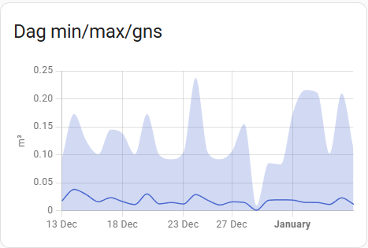

- Card: Statistics graph
  - Period: Week
  - Stat type: Min, Max, Mean
  - Chart type: Line

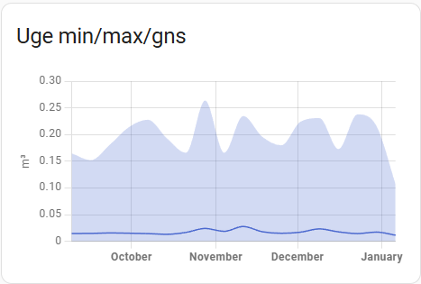

- Card: Statistics graph
  - Period: Week
  - Stat type: Min, Max, Mean
  - Chart type: Line

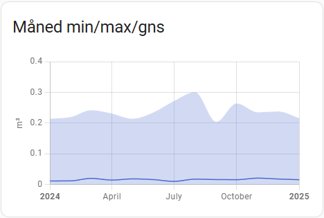

### Statistic card

Using the Statistic card you can show some quick numbers which may be of interest:

- Using the `sensor.novafos_water_statistics` sensor, you can show min /max/mean value of hourly consumption over intervals of this/last year/month/week/day
- Using the `sensor.novafos_water_statistics_{day, week, month, year}` sensors,  you can show min /max/mean value of day/week/month/year consumption over intervals of this/last year/month/week/day

Not all combinations will make sense. So try it out.

Here are some examples using the main sensor:

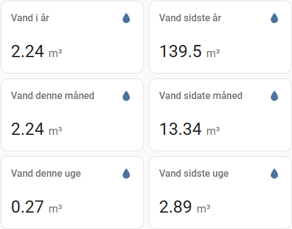

## The optional sensors: sensor.novafos_water_statistics_{day, week, month, year}

These optional sensors help visualising min, max, mean statistics while keeping the magnutide of the aggregation period.
What it means is that the grouping of hourly data into intervals of daily, weekly, monthly and yearly data lets us calculate
the min, man and mean in those intervals and can show the consumption in that resolution varies over time.  This means in
turn that, say the weekly interval can show if certain weeks have a large variation, and how the average consumption
varies over the selected number of days.

The graphs can of course still be shown with the other card-intervals in which case they will just show the averages
with that resolution and magnitude.

Lets show this with with images:

- Card: Statistics graph
  - Sensor: Novafos Water statistics day
  - Period: Day
  - Stat type: Min, Max, Mean
  - Chart type: Line

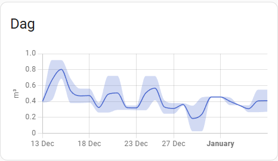

- Card: Statistics graph
  - Sensor: Novafos Water statistics week
  - Period: Week
  - Stat type: Min, Max, Mean
  - Chart type: Line

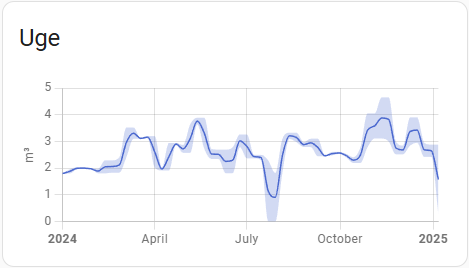

- Card: Statistics graph
  - Sensor: Novafos Water statistics month
  - Period: Month
  - Stat type: Min, Max, Mean
  - Chart type: Line

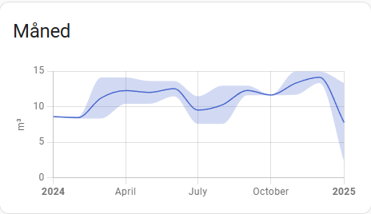


There is a 'year' sensor too for the enthisiast, this one is a _very_ slow moving sensor... but it is there.
Use it with the "month" card period once at least 3 years of data has been collected. Good luck.

# Visualisation of the sensors using apex-chart

So you might say, "but I like Apex-chart better, can I use that?!".  Certainly.  Apex-chart has evolved to also being able to
show statistic sensors.  Not the "external statistic" type though, which for some reason are named "domain:sensor_name" instead of "sensor.sensor_name".

Here are some apex-chart examples.  With these example you should get the idea and work from there.

## Chart showing daily change

The chart can be set to change, min, max, sum

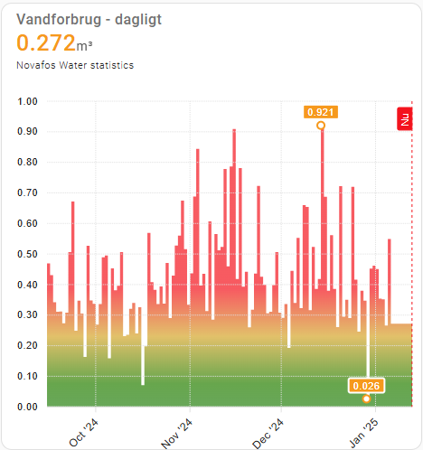

```
type: custom:apexcharts-card
graph_span: 120d
span:
  end: day
now:
  show: true
  label: Nu
  color: red
header:
  show: true
  title: Vandforbrug - dagligt
  show_states: true
  colorize_states: true
experimental:
  color_threshold: true
all_series_config:
  show:
    legend_value: false
    datalabels: false
    extremas: true
    in_brush: true
  float_precision: 3
  type: area
  fill_raw: last
  color_threshold:
    - value: -1
      color: "#1E90FF"
    - value: 0.1
      color: "#008000"
    - value: 0.25
      color: "#DAA520"
    - value: 0.4
      color: "#FF0000"
series:
  - entity: sensor.novafos_water_statistics
    statistics:
      type: change
      period: day
      align: start
apex_config:
  chart:
    height: 400px
    animations:
      enabled: false
      easing: easeinout
      speed: 800
      animateGradually:
        enabled: true
        delay: 150
    zoom:
      enabled: true
      type: x
      autoScaleYaxis: true
      zoomedArea:
        fill:
          color: "#90CAF9"
          opacity: 0.4
        stroke:
          color: "#0D47A1"
          opacity: 0.4
          width: 1
  yaxis:
    decimalsInFloat: 2
    labels:
      show: true
    tooltip:
      enabled: true
    crosshairs:
      show: true
  xaxis:
    labels:
      show: true
      rotate: -45
      rotateAlways: true
  stroke:
    show: false
    curve: stepline
  markers:
    size: 0
  grid:
    show: true
    strokeDashArray: 1
    position: front
    xaxis:
      lines:
        show: true

```

## Weekly chart

This one is considerably less fancy, and shows the weekly aggregation of the hourly dataset.

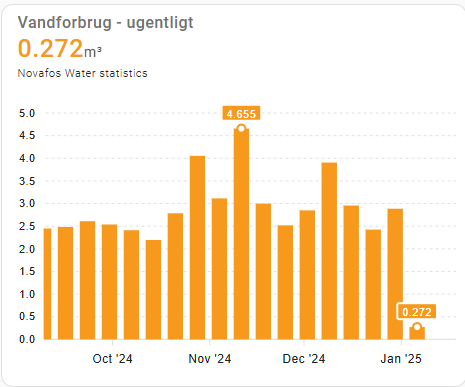

```
type: custom:apexcharts-card
graph_span: 120d
span:
  end: day
header:
  show: true
  title: Vandforbrug - ugentligt
  show_states: true
  colorize_states: true
all_series_config:
  show:
    legend_value: false
    datalabels: false
    extremas: true
    in_brush: true
  float_precision: 3
  type: column
  invert: false
series:
  - entity: sensor.novafos_water_statistics
    statistics:
      type: change
      period: week
      align: start
```

# Debugging

It is possible to debug log the raw response from KMD API. This is done by setting up logging
like below in configuration.yaml in Home Assistant. It is also possible to set the log level
through a service call in UI. Be aware that a lot of information is dumped to the log, so
only have this activated when reporting a bug.  However, _when_ reporting a bug, please have
this information saved to send.  It really helps a lot.

```
logger: 
  default: info
  logs: 
    custom_components.novafos: debug
```
