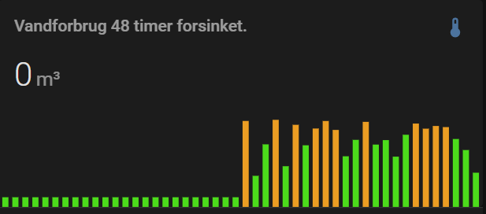

# novafos

[](https://github.com/custom-components/hacs)

The `novafos`component is a Home Assistant custom component for monitoring your water metering data from Novafos (via KMD)

*The custom component is in its very early stage for showing data from Novafos.*

## Installation
---
### Manual Installation
  1. Copy novafos folder into your custom_components folder in your hass configuration directory.
  2. Configure the `novafos` sensor.
  3. Restart Home Assistant.

### Installation with HACS (Home Assistant Community Store)
  1. Ensure that [HACS](https://hacs.xyz/) is installed.
  2. Search for and install the `novafos` integration.
  3. Configure the `novafos` sensor.
  4. Restart Home Assistant.

## Configuration
---
Fully configurable through config flow.
  1. Head to configuration --> integration
  2. Add new and search for novafos
  3. Enter email address and pasword as registered with Novafos.
     If you haven't done this before you need to login using NemId and
     setup email and password first.
  4. Enter the supplier ID as well.  Until a better way to get this automatically is identified, you can get the value from inspecting the browser network traffic. See the next section.<br>
  
### Get the supplier id
  1. In chrome press F12, and select the "Network" tab.
  2. Login on the https://minforsyning-2.kmd.dk webpage.
  3. Inspect the first few entries.  You should see something along the lines of: *https://<6-digit number>.webtools.kmd.dk/wts/...*  The 6 digit number is your `supplier ID`.

## State and attributes
---
!Note! Data is delayed in the data warehouse.  the most recent data was found to be most reliable from 48-24 hours ago from today's midnight.  I.e. the data retrieved is from the day before yesterday.

A sensor for each hour in the last valid 24 hours is created with the syntax:
 * sensor.novafos_water_0_1
 * sensor.novafos_water_1_2
 * etc.

A sensor which sum up the total water used to date (again with delay) is added as well:
 * sensor.novafos_water_total

All sensors show their value in cubuc meters (m3).

## Debugging
It is possible to debug log the raw response from KMD API. This is done by setting up logging like below in configuration.yaml in Home Assistant. It is also possible to set the log level through a service call in UI.  
```
logger: 
  default: info
  logs: 
    pynovafos.novafos: debug
```

## Examples

### Daily average and gauge bar indicating high usage
Below example is an example how to display daily average and a guage indicating high usage. 




**Requirements**

* Recorder component holding minimum the number of days the average display should cover.
* Lovelace Config Template Card (https://github.com/iantrich/config-template-card)

**Average sensor**

Below statistics sensor shows the daily average calculated over the last 30 days. 
```
sensor:
  - platform: statistics
    entity_id: sensor.novafos_water_total
    name: Water Monthly Statistics
    sampling_size: 50
    max_age:
        days: 30

```

**Lovelace**

```
type: vertical-stack
cards:
  - card:
      entity: sensor.novafos_water_total
      max: 20
      min: 0
      name: >-
        ${'Vandforbrug d. ' +
        states['sensor.novafos_water_total'].attributes.metering_date }
      severity:
        green: 0
        red: '${states[''sensor.novafos_water_monthly_statistics''].state * 1.25}'
        yellow: '${states[''novafos_water_monthly_statistics''].state * 1.10}'
      type: gauge
    entities:
      - sensor.novafos_water_total
      - sensor.novafos_water_statistics
    type: 'custom:config-template-card'
  - type: entity
    entity: sensor.novafos_water_statistics
    name: Daglig gennemsnit

```

**Year to date graph**
```
type: 'custom:mini-graph-card'
hours_to_show: 72
aggregate_func: max
color_thresholds:
  - color: '#17DD1B'
    value: 50
  - color: '#f39c12'
    value: 100
  - color: '#FF5600'
    value: 150
  - color: '#c0392b'
    value: 170
entities:
  - entity: sensor.novafos_water_total
    name: total
group_by: date
hour24: true
name: 'Vandforbrug i år, 48 timer forsinket'
show:
  fill: true
  graph: bar
  labels: false
  legend: false
```

**Hourly graph with lastest data**
```
type: 'custom:mini-graph-card'
hours_to_show: 48
aggregate_func: max
color_thresholds:
  - color: '#17DD1B'
    value: 0.65
  - color: '#f39c12'
    value: 0.8
  - color: '#FF5600'
    value: 1
  - color: '#c0392b'
    value: 1.2
entities:
  - entity: sensor.novafos_water_0_1
    name: 00-01
  - entity: sensor.novafos_water_1_2
    name: 01-02
  - entity: sensor.novafos_water_2_3
    name: 02-03
  - entity: sensor.novafos_water_3_4
    name: 03-04
  - entity: sensor.novafos_water_4_5
    name: 04-05
  - entity: sensor.novafos_water_5_6
    name: 05-06
  - entity: sensor.novafos_water_6_7
    name: 06-07
  - entity: sensor.novafos_water_7_8
    name: 07-08
  - entity: sensor.novafos_water_8_9
    name: 08-09
  - entity: sensor.novafos_water_9_10
    name: 09-10
  - entity: sensor.novafos_water_10_11
    name: 10-11
  - entity: sensor.novafos_water_11_12
    name: 11-12
  - entity: sensor.novafos_water_12_13
    name: 12-13
  - entity: sensor.novafos_water_13_14
    name: 13-14
  - entity: sensor.novafos_water_14_15
    name: 14-15
  - entity: sensor.novafos_water_15_16
    name: 15-16
  - entity: sensor.novafos_water_16_17
    name: 16-17
  - entity: sensor.novafos_water_17_18
    name: 17-18
  - entity: sensor.novafos_water_18_19
    name: 18-19
  - entity: sensor.novafos_water_19_20
    name: 19-20
  - entity: sensor.novafos_water_20_21
    name: 20-21
  - entity: sensor.novafos_water_21_22
    name: 21-22
  - entity: sensor.novafos_water_22_23
    name: 22-23
  - entity: sensor.novafos_water_23_24
    name: 23-24
group_by: date
hour24: true
name: Vandforbrug 48 timer forsinket.
show:
  fill: true
  graph: bar
  labels: false
  legend: false
```
